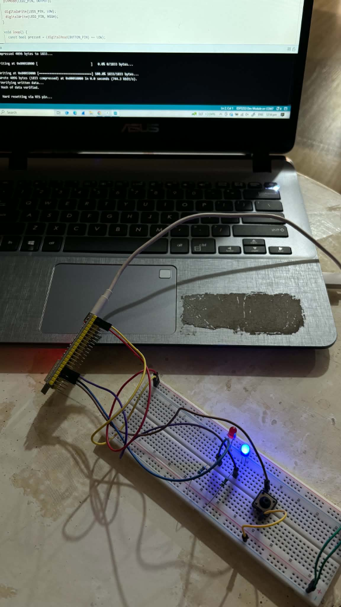
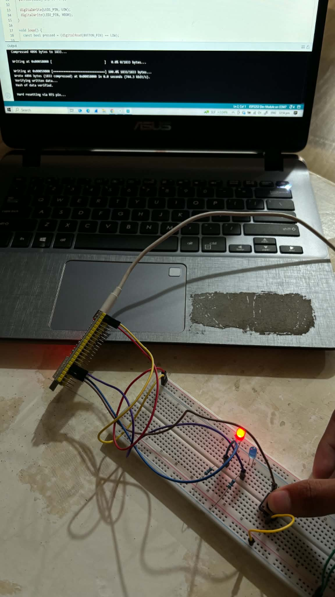

# Laboratory Activity 3: GPIO and Button Control

## 1. Source Code

```cpp
#include <Arduino.h>

const uint8_t BUTTON_PIN = 4;
const uint8_t LED1_PIN   = 5;
const uint8_t LED2_PIN   = 6;

void setup() {
  pinMode(BUTTON_PIN, INPUT_PULLUP);

  pinMode(LED1_PIN, OUTPUT);
  pinMode(LED2_PIN, OUTPUT);

  digitalWrite(LED1_PIN, LOW);
  digitalWrite(LED2_PIN, HIGH);
}

void loop() {
  const bool pressed = (digitalRead(BUTTON_PIN) == LOW);

  digitalWrite(LED1_PIN, pressed ? HIGH : LOW);

  digitalWrite(LED2_PIN, pressed ? LOW : HIGH);
}
```

---

## 2. Labeled Circuit Diagram and Photos

### Schematic Diagram


### Circuit Testing & Documentation
| Button Released (Blue LED ON, Red LED OFF) | Button Pressed (Red LED ON, Blue LED OFF) |
| :---: | :---: |
|  |  |

---

## 3. Pressed / Released Observation Table

| Button State | `digitalRead(BUTTON_PIN)` | LED 1 - Red (GPIO 5) | LED 2 - Blue (GPIO 6) |
| :--- | :--- | :--- | :--- |
| **Released** | HIGH | OFF | ON |
| **Pressed** | LOW | ON | OFF |
