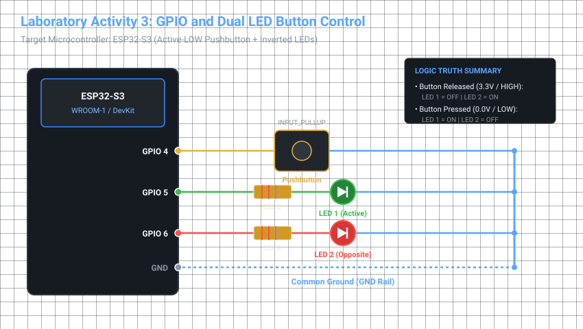

# Laboratory Activity 3: GPIO and Button Control

**Course:** BCA188 - IoT Firmware Programming and Device I/O  
**Target Board:** ESP32-S3 (Espressif Systems)  
**IDE:** Arduino IDE / PlatformIO  

---

## 📌 Activity Overview

The objective of this laboratory activity is to assemble a pushbutton and dual status LED circuit, configure digital input with internal pull-up resistors (`INPUT_PULLUP`), and implement firmware logic where:
- A primary status LED (**LED 1**) lights up while the pushbutton is held down.
- A secondary status LED (**LED 2**) continuously displays the **opposite state** (ON when released, OFF when pressed).

> [!IMPORTANT]
> **ESP32-S3 Pin Configuration Note:**  
> The original reference code (Example 2) was designed for legacy ESP32-WROOM boards using `BUTTON_PIN = 23` and `LED_PIN = 18`. On the **ESP32-S3 architecture, GPIO 22, 23, 24, and 25 do not exist physically on the chip**.  
> This implementation adapts the pin assignments to clean, safe, general-purpose pins:
> - **Pushbutton Input:** `GPIO 4`
> - **Status LED 1 (Main):** `GPIO 5`
> - **Status LED 2 (Opposite):** `GPIO 6`

---

## 🔌 1. Labeled Circuit Schematic & GPIO Connections

Before applying power, the GPIO connections are mapped and verified as follows:



### Hardware Connection Table

| Component | Component Terminal | ESP32-S3 Pin | Function / Description |
| :--- | :--- | :--- | :--- |
| **Pushbutton** | Pin 1 (Input leg) | **GPIO 4** | Digital Input with `INPUT_PULLUP` enabled |
| **Pushbutton** | Pin 2 (Diagonal leg) | **GND** | Direct path to ground on button press |
| **LED 1 (Green)** | Anode (Long leg, `+`) | **GPIO 5** | Digital Output (Active-HIGH) |
| **LED 1 (Green)** | Cathode (Short leg, `-`) | Via 220 $\Omega$ Resistor to **GND** | Current-limiting protection |
| **LED 2 (Red)** | Anode (Long leg, `+`) | **GPIO 6** | Digital Output (Inverted Logic) |
| **LED 2 (Red)** | Cathode (Short leg, `-`) | Via 220 $\Omega$ Resistor to **GND** | Current-limiting protection |
| **Common Rail** | Breadboard (`-`) Rail | **GND** | Ground reference for all peripherals |

---

## 🧪 2. Verified Released and Pressed Behavior

1. **Button Released State:**
   - The pushbutton contacts remain open.
   - The ESP32-S3 internal pull-up resistor pulls `GPIO 4` to $3.3\text{ V}$ (`HIGH`).
   - The firmware evaluates `(digitalRead(BUTTON_PIN) == LOW)` as `false`.
   - **LED 1** receives `LOW` $\rightarrow$ **Turns OFF**.
   - **LED 2** receives `HIGH` $\rightarrow$ **Turns ON**.

2. **Button Pressed State:**
   - The pushbutton contacts close, bridging `GPIO 4` directly to `GND` ($0.0\text{ V}$).
   - The pin voltage drops to $0\text{ V}$ (`LOW`).
   - The firmware evaluates `(digitalRead(BUTTON_PIN) == LOW)` as `true`.
   - **LED 1** receives `HIGH` $\rightarrow$ **Turns ON**.
   - **LED 2** receives `LOW` $\rightarrow$ **Turns OFF**.

---

## 💡 3. Explanation: Meaning of HIGH and LOW for the Button

### What `HIGH` Means:
When the button is **released**, the physical circuit to ground is disconnected (open switch). Because the pin is configured with `INPUT_PULLUP`, the ESP32-S3 connects an internal high-impedance resistor (~$45\text{ k}\Omega$) between the GPIO pin and the internal $3.3\text{ V}$ supply ($V_{DD}$). This holds the pin at a stable **$3.3\text{ V}$ logic level (`HIGH`)**.
* **Crucial Role of Pull-Up:** Without the pull-up resistor, an open input pin would act as an antenna and "float," picking up electromagnetic noise that causes random switching between `0` and `1`.

### What `LOW` Means:
When the button is **pressed**, the mechanical contacts close, connecting the GPIO pin directly to `GND` ($0\text{ V}$). Because this direct path to Ground has virtually zero resistance compared to the internal $45\text{ k}\Omega$ pull-up resistor, the voltage at the pin collapses to **$0.0\text{ V}$ logic level (`LOW`)**.

### Why Active-LOW Logic is Standard in Embedded Systems:
In this configuration, **`LOW` signifies active/pressed**, while **`HIGH` signifies idle/released**. This is called **Active-LOW** logic. The line:
```cpp
const bool pressed = (digitalRead(BUTTON_PIN) == LOW);
```
converts the Active-LOW electrical signal into a human-readable boolean flag (`pressed = true` when pressed, `false` when released).

---

## 🔄 4. Reset Behavior & Initial Output Confirmation

When the physical **RESET (EN/RST)** button on the ESP32-S3 is triggered:
1. The microcontroller performs a hardware reboot and executes `setup()`.
2. The pin directions are set (`INPUT_PULLUP` for GPIO 4, `OUTPUT` for GPIO 5 & 6).
3. The initial outputs are explicitly defined before `loop()` starts:
   ```cpp
   digitalWrite(LED1_PIN, LOW);   // LED 1 starts OFF
   digitalWrite(LED2_PIN, HIGH);  // LED 2 starts ON
   ```
4. **Result:** Immediately upon boot/reset, with the button untouched, **LED 1 is dark (OFF)** and **LED 2 is illuminated (ON)**. There is zero output bouncing or indeterminate flickering.

---

## 📊 5. Pressed / Released Observation Table

| Button State | Physical Input Voltage (GPIO 4) | `digitalRead(BUTTON_PIN)` | Evaluated `pressed` Flag | LED 1 State (GPIO 5) | LED 2 State (GPIO 6) | Observation Summary |
| :--- | :--- | :--- | :--- | :--- | :--- | :--- |
| **Released** | $\approx 3.3\text{ V}$ | `HIGH` (1) | `false` | **OFF** | **ON** | Stable; no flicker when released |
| **Pressed** | $0.0\text{ V}$ (GND) | `LOW` (0) | `true` | **ON** | **OFF** | LEDs instantly invert state |

---

## 💻 6. Source Code (`Laboratory_Activity_3.ino`)

```cpp
#include <Arduino.h>

const uint8_t BUTTON_PIN = 4;
const uint8_t LED1_PIN   = 5;
const uint8_t LED2_PIN   = 6;

void setup() {
  pinMode(BUTTON_PIN, INPUT_PULLUP);

  pinMode(LED1_PIN, OUTPUT);
  pinMode(LED2_PIN, OUTPUT);

  digitalWrite(LED1_PIN, LOW);
  digitalWrite(LED2_PIN, HIGH);
}

void loop() {
  const bool pressed = (digitalRead(BUTTON_PIN) == LOW);

  digitalWrite(LED1_PIN, pressed ? HIGH : LOW);

  digitalWrite(LED2_PIN, pressed ? LOW : HIGH);
}
```

---

## 🚀 How to Flash & Run

1. Connect your ESP32-S3 to your PC using a **data-capable USB-C cable**.
2. Open **Arduino IDE**.
3. Select board: `Tools > Board > esp32 > ESP32S3 Dev Module`.
4. Configure upload settings:
   - **USB CDC On Boot:** `Enabled`
   - **Upload Mode:** `UART0 / Hardware CDC`
5. Select the port under `Tools > Port` (e.g., `COM6`).
6. Click **Upload** (or use keyboard shortcut `Ctrl + U`).
7. Once uploaded, test pressing and releasing the tactile switch to verify the complementary LED actions.

---

## 🏆 Success Criteria Verification
- [x] **Opposite States:** When LED 1 is ON, LED 2 is OFF, and vice-versa.
- [x] **No Floating / Random State Changes:** The `INPUT_PULLUP` keeps the input securely at $3.3\text{ V}$ when released, eliminating electromagnetic noise sensitivity.
- [x] **Verified Initial Reset State:** System reliably defaults to LED 1 = OFF, LED 2 = ON upon power-up and reset.
